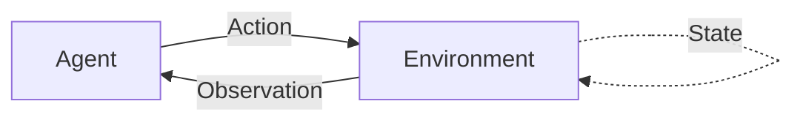

# Environments

Environments provide structured contexts for agents to interact with external systems. The framework includes three built-in environments: **Web**, **CLI**, and **File** - each designed for specific types of agent tasks.

## Overview

An environment defines:

- **Actions**: What the agent can do
- **Observations**: What the agent sees after each action
- **State**: The current status of the environment



## Web Environment

The `WebEnvironment` enables agents to interact with web pages through browser automation.

### Basic Usage

```python
from react_agent_framework.core.environment import WebEnvironment, Action

# Create web environment
env = WebEnvironment(
    start_url="https://example.com",
    headless=True,  # Run without visible browser
    browser_type="chromium"  # chromium, firefox, or webkit
)

# Initialize environment
initial_obs = env.reset()
print(initial_obs.to_string())

# Navigate to a page
action = Action(
    name="navigate",
    parameters={"url": "https://python.org"}
)
obs = env.step(action)
print(f"Page title: {obs.data['title']}")

# Close when done
env.close()
```

### Available Actions

#### Navigate

Navigate to a URL:

```python
action = Action(
    name="navigate",
    parameters={"url": "https://github.com"}
)
obs = env.step(action)
# Returns: {url, title, content, status}
```

#### Click

Click an element on the page:

```python
action = Action(
    name="click",
    parameters={"selector": "button.login"}
)
obs = env.step(action)
# Returns: {action, selector, result}
```

#### Type

Type text into an input field:

```python
action = Action(
    name="type",
    parameters={
        "selector": "input#search",
        "text": "python programming"
    }
)
obs = env.step(action)
# Returns: {action, selector, text, result}
```

#### Scroll

Scroll the page:

```python
action = Action(
    name="scroll",
    parameters={"direction": "down"}  # or "up"
)
obs = env.step(action)
# Returns: {action, direction, result}
```

#### Extract

Extract text from an element:

```python
action = Action(
    name="extract",
    parameters={"selector": "div.content"}
)
obs = env.step(action)
print(obs.data['text'])
# Returns: {action, selector, text}
```

### Complete Example

```python
from react_agent_framework.core.environment import WebEnvironment, Action

# Web scraping agent
with WebEnvironment(start_url="https://news.ycombinator.com") as env:
    # Navigate to Hacker News
    obs = env.reset()
    print(f"Loaded: {obs.data['title']}")

    # Extract top stories
    action = Action(
        name="extract",
        parameters={"selector": ".storylink"}
    )
    obs = env.step(action)
    print(f"Top stories: {obs.data['text']}")

    # Get available actions
    print(f"Available actions: {env.get_available_actions()}")
    # Output: ['navigate', 'click', 'type', 'scroll', 'extract']
```

### Integration with ReactAgent

```python
from react_agent_framework import ReactAgent
from react_agent_framework.core.environment import WebEnvironment, Action

# Create agent with web capabilities
agent = ReactAgent(
    name="Web Researcher",
    provider="gpt-4o-mini"
)

# Add web environment
web_env = WebEnvironment(start_url="about:blank")

@agent.tool()
def navigate_web(url: str) -> str:
    """Navigate to a URL and extract content"""
    action = Action(name="navigate", parameters={"url": url})
    obs = web_env.step(action)
    return f"Navigated to {obs.data['title']}: {obs.data['content'][:200]}"

@agent.tool()
def extract_text(selector: str) -> str:
    """Extract text from page element"""
    action = Action(name="extract", parameters={"selector": selector})
    obs = web_env.step(action)
    return obs.data.get('text', 'No text found')

# Use agent
answer = agent.run(
    "Go to python.org and extract the main heading",
    verbose=True
)
```

!!! note "Browser Automation"
    For full browser automation, install Playwright or Selenium:
    ```bash
    pip install playwright
    playwright install chromium
    ```

## CLI Environment

The `CLIEnvironment` allows agents to execute shell commands safely.

### Basic Usage

```python
from react_agent_framework.core.environment import CLIEnvironment, Action

# Create CLI environment
env = CLIEnvironment(
    working_directory="/tmp",
    safe_mode=True,  # Restrict to safe commands
    timeout=30  # Command timeout in seconds
)

# Initialize
obs = env.reset()
print(obs.data['directory'])

# Execute command
action = Action(
    name="execute",
    parameters={"command": "ls -la"}
)
obs = env.step(action)
print(obs.data['stdout'])
```

### Available Actions

#### Execute

Run a shell command:

```python
action = Action(
    name="execute",
    parameters={"command": "pwd"}
)
obs = env.step(action)
print(f"Output: {obs.data['stdout']}")
print(f"Exit code: {obs.data['exit_code']}")
# Returns: {command, stdout, stderr, exit_code, success}
```

#### Change Directory

```python
action = Action(
    name="cd",
    parameters={"directory": "src"}
)
obs = env.step(action)
print(f"New directory: {obs.data['directory']}")
# Returns: {action, directory, success}
```

#### Print Working Directory

```python
action = Action(name="pwd", parameters={})
obs = env.step(action)
print(obs.data['directory'])
# Returns: {action, directory}
```

### Safe Mode

Safe mode restricts command execution:

```python
# Safe mode enabled (default)
env = CLIEnvironment(safe_mode=True)

# Allowed commands: ls, pwd, echo, cat, grep, etc.
action = Action(name="execute", parameters={"command": "ls"})
obs = env.step(action)  # ✅ Works

# Blocked commands: rm, sudo, chmod, etc.
action = Action(name="execute", parameters={"command": "rm -rf /"})
obs = env.step(action)  # ❌ Blocked
print(obs.data['error'])  # "Command blocked by safe mode"
```

**Safe commands whitelist:**
- `ls`, `pwd`, `echo`, `cat`, `head`, `tail`
- `grep`, `find`, `wc`, `date`, `whoami`
- `hostname`, `df`, `du`, `which`, `whereis`

**Blocked commands:**
- `rm`, `rmdir`, `mv`, `chmod`, `chown`
- `kill`, `sudo`, `su`, `shutdown`, `reboot`

### Complete Example

```python
from react_agent_framework.core.environment import CLIEnvironment, Action

# System admin agent
with CLIEnvironment(working_directory="/tmp", safe_mode=True) as env:
    # Check current directory
    obs = env.reset()
    print(f"Working in: {obs.data['directory']}")

    # List files
    action = Action(name="execute", parameters={"command": "ls -l"})
    obs = env.step(action)
    print(f"Files:\n{obs.data['stdout']}")

    # Check disk usage
    action = Action(name="execute", parameters={"command": "df -h"})
    obs = env.step(action)
    print(f"Disk usage:\n{obs.data['stdout']}")

    # Get environment status
    status = env.get_status()
    print(f"Steps executed: {status['steps']}")
```

### Integration with ReactAgent

```python
from react_agent_framework import ReactAgent
from react_agent_framework.core.environment import CLIEnvironment, Action

agent = ReactAgent(name="DevOps Assistant", provider="gpt-4o-mini")

cli_env = CLIEnvironment(safe_mode=True)

@agent.tool()
def run_command(command: str) -> str:
    """Execute a safe shell command"""
    action = Action(name="execute", parameters={"command": command})
    obs = cli_env.step(action)

    if obs.data.get('success'):
        return obs.data['stdout']
    else:
        return f"Error: {obs.data.get('error', obs.data.get('stderr'))}"

@agent.tool()
def check_directory() -> str:
    """Check current working directory"""
    action = Action(name="pwd", parameters={})
    obs = cli_env.step(action)
    return obs.data['directory']

# Use agent
answer = agent.run(
    "List all Python files in the current directory",
    verbose=True
)
```

## File Environment

The `FileEnvironment` enables agents to navigate and manipulate the file system.

### Basic Usage

```python
from react_agent_framework.core.environment import FileEnvironment, Action

# Create file environment
env = FileEnvironment(
    root_directory="./data",
    safe_mode=True,  # Protect sensitive files
    max_file_size=10 * 1024 * 1024  # 10MB limit
)

# Initialize
obs = env.reset()
print(f"Files: {obs.data['contents']}")

# Read a file
action = Action(
    name="read",
    parameters={"filepath": "example.txt"}
)
obs = env.step(action)
print(obs.data['content'])
```

### Available Actions

#### List Directory

```python
action = Action(
    name="list",
    parameters={"path": "./src"}
)
obs = env.step(action)
for item in obs.data['contents']:
    print(f"{item['type']}: {item['name']} ({item.get('size', 'N/A')} bytes)")
# Returns: {action, path, contents[], count}
```

#### Read File

```python
action = Action(
    name="read",
    parameters={"filepath": "config.json"}
)
obs = env.step(action)
print(obs.data['content'])
# Returns: {action, filepath, content, size}
```

#### Write File

```python
action = Action(
    name="write",
    parameters={
        "filepath": "output.txt",
        "content": "Hello, World!"
    }
)
obs = env.step(action)
print(f"Written {obs.data['bytes_written']} bytes")
# Returns: {action, filepath, bytes_written, success}
```

#### Create Directory

```python
action = Action(
    name="create_dir",
    parameters={"dirname": "new_folder"}
)
obs = env.step(action)
# Returns: {action, path, success}
```

#### Navigate

```python
action = Action(
    name="navigate",
    parameters={"path": "./src"}
)
obs = env.step(action)
print(f"Now in: {obs.data['directory']}")
# Returns: {action, directory, contents[]}
```

#### Search

Search for files matching a pattern:

```python
action = Action(
    name="search",
    parameters={"pattern": "*.py"}
)
obs = env.step(action)
print(f"Found {obs.data['count']} Python files:")
for match in obs.data['matches']:
    print(f"  - {match}")
# Returns: {action, pattern, matches[], count}
```

### Safe Mode

Protects sensitive files from being read or modified:

```python
env = FileEnvironment(safe_mode=True)

# Sensitive patterns blocked:
# .ssh, .env, password, secret, credential, .key, token, id_rsa

# Try to read sensitive file
action = Action(name="read", parameters={"filepath": ".env"})
obs = env.step(action)
print(obs.data['error'])  # "Access denied: Sensitive file"
```

### Complete Example

```python
from react_agent_framework.core.environment import FileEnvironment, Action

# File manager agent
with FileEnvironment(root_directory="./project") as env:
    # Initialize and list files
    obs = env.reset()
    print(f"Project files: {len(obs.data['contents'])} items")

    # Search for Python files
    action = Action(name="search", parameters={"pattern": "*.py"})
    obs = env.step(action)
    print(f"Found {obs.data['count']} Python files")

    # Read a specific file
    action = Action(name="read", parameters={"filepath": "main.py"})
    obs = env.step(action)
    print(f"File size: {obs.data['size']} bytes")

    # Create a report
    report = f"Project analysis:\n{len(obs.data['content'])} lines of code"
    action = Action(
        name="write",
        parameters={"filepath": "report.txt", "content": report}
    )
    obs = env.step(action)
    print(f"Report saved ({obs.data['bytes_written']} bytes)")
```

### Integration with ReactAgent

```python
from react_agent_framework import ReactAgent
from react_agent_framework.core.environment import FileEnvironment, Action

agent = ReactAgent(name="File Assistant", provider="gpt-4o-mini")

file_env = FileEnvironment(root_directory="./data", safe_mode=True)

@agent.tool()
def list_files(directory: str = ".") -> str:
    """List files in a directory"""
    action = Action(name="list", parameters={"path": directory})
    obs = file_env.step(action)

    if 'error' in obs.data:
        return obs.data['error']

    files = [f"{item['name']} ({item['type']})" for item in obs.data['contents']]
    return f"Found {len(files)} items:\n" + "\n".join(files)

@agent.tool()
def read_file(filepath: str) -> str:
    """Read contents of a file"""
    action = Action(name="read", parameters={"filepath": filepath})
    obs = file_env.step(action)

    if 'error' in obs.data:
        return f"Error: {obs.data['error']}"

    return obs.data['content']

@agent.tool()
def search_files(pattern: str) -> str:
    """Search for files matching pattern"""
    action = Action(name="search", parameters={"pattern": pattern})
    obs = file_env.step(action)

    matches = obs.data['matches']
    return f"Found {len(matches)} files:\n" + "\n".join(matches)

# Use agent
answer = agent.run(
    "Find all JSON files and read the first one you find",
    verbose=True
)
```

## Environment State

All environments track their state:

```python
from react_agent_framework.core.environment import FileEnvironment, Action

env = FileEnvironment()
env.reset()

# Perform several actions
env.step(Action(name="list", parameters={}))
env.step(Action(name="read", parameters={"filepath": "test.txt"}))
env.step(Action(name="search", parameters={"pattern": "*.md"}))

# Get state
state = env.get_state()
print(f"Steps taken: {state.step_count}")
print(f"Action history: {len(state.action_history)}")
print(f"Current observation: {state.current_observation}")

# Get recent history
history = env.get_history(n=5)  # Last 5 steps
for action, obs in history:
    print(f"Action: {action.name} -> Observation: {obs.to_string()[:50]}")
```

## Context Manager Support

All environments support context managers for automatic cleanup:

```python
# Automatic initialization and cleanup
with WebEnvironment() as web_env:
    obs = web_env.step(Action(name="navigate", parameters={"url": "https://python.org"}))
    # Environment automatically closed when done

with CLIEnvironment() as cli_env:
    obs = cli_env.step(Action(name="execute", parameters={"command": "ls"}))
    # Environment automatically closed

with FileEnvironment() as file_env:
    obs = file_env.step(Action(name="list", parameters={}))
    # Environment automatically closed
```

## Creating Custom Environments

Extend `BaseEnvironment` to create custom environments:

```python
from react_agent_framework.core.environment import BaseEnvironment, Action, Observation
from typing import List, Dict, Any

class DatabaseEnvironment(BaseEnvironment):
    """Custom environment for database interactions"""

    def __init__(self, connection_string: str):
        super().__init__(name="DatabaseEnvironment")
        self.connection_string = connection_string
        self.connection = None

    def reset(self) -> Observation:
        """Initialize database connection"""
        # Connect to database
        self.connection = self._connect()

        obs = Observation(
            data={"status": "connected", "database": "mydb"}
        )
        self.state.current_observation = obs
        return obs

    def step(self, action: Action) -> Observation:
        """Execute database action"""
        if action.name == "query":
            sql = action.parameters.get("sql", "")
            results = self._execute_query(sql)
            return Observation(data={"results": results})

        elif action.name == "insert":
            table = action.parameters.get("table", "")
            data = action.parameters.get("data", {})
            success = self._insert_data(table, data)
            return Observation(data={"success": success})

        return Observation(data={"error": "Unknown action"})

    def get_available_actions(self) -> List[str]:
        return ["query", "insert", "update", "delete"]

    def get_observation_space(self) -> Dict[str, Any]:
        return {
            "results": "Query results",
            "affected_rows": "Number of rows affected",
            "success": "Operation success status"
        }

    def _connect(self):
        # Database connection logic
        pass

    def _execute_query(self, sql: str):
        # Query execution logic
        pass

    def _insert_data(self, table: str, data: dict):
        # Insert logic
        pass

    def close(self):
        """Cleanup database connection"""
        if self.connection:
            self.connection.close()
```

## Best Practices

### 1. Always Use Context Managers

```python
# ✅ Good: Automatic cleanup
with FileEnvironment() as env:
    obs = env.step(action)

# ❌ Bad: Manual cleanup required
env = FileEnvironment()
obs = env.step(action)
env.close()  # Easy to forget!
```

### 2. Enable Safe Mode for Production

```python
# ✅ Good: Safe mode enabled
cli_env = CLIEnvironment(safe_mode=True)
file_env = FileEnvironment(safe_mode=True)

# ❌ Bad: Safe mode disabled (only for testing)
cli_env = CLIEnvironment(safe_mode=False)
```

### 3. Set Appropriate Timeouts

```python
# ✅ Good: Reasonable timeout
cli_env = CLIEnvironment(timeout=30)

# ❌ Bad: No timeout or too long
cli_env = CLIEnvironment(timeout=300)  # 5 minutes is too long
```

### 4. Handle Errors Gracefully

```python
# ✅ Good: Check for errors
obs = env.step(action)
if obs.metadata.get('error'):
    print(f"Error: {obs.data.get('error')}")
else:
    print(f"Success: {obs.data}")

# ❌ Bad: Assume success
obs = env.step(action)
print(obs.data['content'])  # May not exist if error
```

### 5. Limit File Sizes

```python
# ✅ Good: Set reasonable limits
file_env = FileEnvironment(max_file_size=10 * 1024 * 1024)  # 10MB

# ❌ Bad: No limit
file_env = FileEnvironment(max_file_size=float('inf'))
```

## Comparison

| Environment | Best For | Safety Features | Network Required |
|-------------|----------|----------------|------------------|
| **Web** | Browser automation, web scraping | Headless mode | Yes |
| **CLI** | System administration, DevOps | Safe mode, command whitelist | No |
| **File** | File management, data processing | Safe mode, size limits | No |

## Next Steps

- [Built-in Tools](built-in-tools.md) - Learn about tool integration
- [Custom Tools](../guides/custom-tools.md) - Create tools for environments
- [Reasoning Strategies](reasoning-strategies.md) - Optimize agent behavior
- [Memory Systems](memory-systems.md) - Add persistent context

## Further Reading

- [Gymnasium](https://gymnasium.farama.org/) - RL environment standard
- [OpenAI Gym](https://www.gymlibrary.dev/) - Classic environment framework
- [Playwright](https://playwright.dev/python/) - Browser automation
