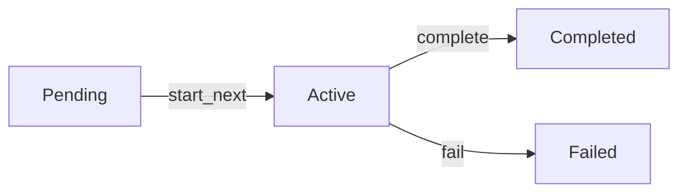

# Objectives System

Create goal-oriented agents that track and pursue objectives systematically.

---

## Overview

The Objectives system allows agents to:

- 🎯 **Track goals** with priorities and deadlines
- 📊 **Monitor progress** toward completion
- ✅ **Define success criteria** for each objective
- 🔄 **Manage multiple objectives** simultaneously

```python
from react_agent_framework import ReactAgent
from react_agent_framework.core.objectives import Objective

# Create agent with objectives
agent = ReactAgent(
    name="Goal-Oriented Assistant",
    objectives=[
        Objective(
            goal="Research Python frameworks",
            priority="high",
            success_criteria=["Find 3+ frameworks", "Compare features"]
        )
    ]
)
```

---

## Creating Objectives

### Basic Objective

```python
from react_agent_framework.core.objectives import Objective

objective = Objective(
    goal="Complete the project documentation",
    priority="high"
)
```

### Complete Objective

```python
from datetime import datetime, timedelta

objective = Objective(
    goal="Deploy application to production",
    description="Deploy the web application with all features",
    priority="critical",
    success_criteria=[
        "All tests pass",
        "Documentation is complete",
        "Deployment successful"
    ],
    deadline=datetime.now() + timedelta(days=7),
    metadata={"project": "webapp", "team": "backend"}
)
```

---

## Priority Levels

Objectives support 4 priority levels:

```python
from react_agent_framework.core.objectives import Priority

# Available priorities
Priority.LOW       # Nice to have
Priority.MEDIUM    # Important
Priority.HIGH      # Very important
Priority.CRITICAL  # Must do immediately
```

**Example**:

```python
# Using string (converted automatically)
obj1 = Objective(goal="Task 1", priority="low")
obj2 = Objective(goal="Task 2", priority="high")

# Using enum directly
from react_agent_framework.core.objectives import Priority

obj3 = Objective(goal="Task 3", priority=Priority.CRITICAL)
```

---

## Objective Tracker

Manage multiple objectives with `ObjectiveTracker`:

### Basic Usage

```python
from react_agent_framework.core.objectives import Objective, ObjectiveTracker

# Create tracker
tracker = ObjectiveTracker()

# Add objectives
tracker.add(Objective(
    goal="Research AI frameworks",
    priority="high"
))

tracker.add(Objective(
    goal="Write documentation",
    priority="medium"
))

tracker.add(Objective(
    goal="Deploy to production",
    priority="critical"
))

# Get summary
print(tracker.get_summary())
```

**Output**:
```
📋 OBJECTIVES SUMMARY
====================

🔥 CRITICAL: 1
⬆️  HIGH: 1
➡️  MEDIUM: 1
⬇️  LOW: 0

Total: 3 objectives
Active: 0 | Pending: 3 | Completed: 0 | Failed: 0
```

---

## Working with Objectives

### Start Next Objective

Automatically starts the highest priority pending objective:

```python
tracker = ObjectiveTracker()

# Add objectives
tracker.add(Objective(goal="Task 1", priority="low"))
tracker.add(Objective(goal="Task 2", priority="critical"))
tracker.add(Objective(goal="Task 3", priority="high"))

# Start next (will pick "Task 2" - critical priority)
next_obj = tracker.start_next()
print(f"Started: {next_obj.goal}")
```

### Update Progress

```python
# Update progress (0.0 to 1.0)
tracker.update_progress(
    objective_id=next_obj.id,
    progress=0.5,
    notes="Halfway done"
)

print(f"Progress: {next_obj.progress:.0%}")  # "50%"
```

### Complete Objective

```python
# Mark as completed
tracker.complete(
    objective_id=next_obj.id,
    notes="All tasks finished successfully"
)
```

### Fail Objective

```python
# Mark as failed
tracker.fail(
    objective_id=next_obj.id,
    notes="Blocked by external dependency"
)
```

---

## Agent Integration

### Create Agent with Objectives

```python
from react_agent_framework import ReactAgent
from react_agent_framework.core.objectives import Objective

# Define objectives
objectives = [
    Objective(
        goal="Calculate total revenue",
        priority="high",
        success_criteria=["Get all sales data", "Sum totals"]
    ),
    Objective(
        goal="Generate report",
        priority="medium",
        success_criteria=["Create PDF", "Send via email"]
    )
]

# Create agent
agent = ReactAgent(
    name="Business Assistant",
    provider="gpt-4o-mini",
    objectives=objectives
)

# Agent is aware of its objectives
answer = agent.run("What are my current goals?")
```

### Access Objectives

```python
# Get all objectives
all_objectives = agent.objectives.get_all()

# Get by status
active = agent.objectives.get_active()
pending = agent.objectives.get_pending()
completed = agent.objectives.get_completed()

# Get by priority
critical = agent.objectives.get_by_priority("critical")
```

---

## Complete Example

Goal-oriented agent that tracks progress:

```python
from react_agent_framework import ReactAgent
from react_agent_framework.core.objectives import Objective

# Create objectives
objectives = [
    Objective(
        goal="Calculate quarterly revenue",
        priority="critical",
        success_criteria=[
            "Get Q1 sales: $50K",
            "Get Q2 sales: $60K",
            "Get Q3 sales: $55K",
            "Get Q4 sales: $65K",
            "Sum total"
        ]
    ),
    Objective(
        goal="Analyze growth rate",
        priority="high",
        success_criteria=["Calculate YoY growth"]
    )
]

# Create agent
agent = ReactAgent(
    name="Financial Analyst",
    provider="gpt-4o-mini",
    objectives=objectives
)

# Add calculator tool
@agent.tool()
def calculate(expression: str) -> str:
    """Perform calculations"""
    try:
        result = eval(expression, {"__builtins__": {}}, {})
        return f"Result: {result}"
    except Exception as e:
        return f"Error: {str(e)}"

# Agent works on objectives
print("📋 Initial Objectives:")
print(agent.objectives.get_summary())

# Run agent - it knows its goals
answer = agent.run("Calculate the total quarterly revenue", verbose=True)

print(f"\n✅ Answer: {answer}")

# Check progress
print("\n📊 Updated Objectives:")
print(agent.objectives.get_summary())
```

---

## Objective Properties

| Property | Type | Description |
|----------|------|-------------|
| `id` | str | Unique identifier (auto-generated) |
| `goal` | str | What to achieve |
| `description` | str | Detailed explanation (optional) |
| `priority` | Priority | Importance level |
| `status` | str | pending/active/completed/failed |
| `progress` | float | 0.0 to 1.0 |
| `success_criteria` | list | List of criteria to meet |
| `deadline` | datetime | When to complete by (optional) |
| `created_at` | datetime | When created |
| `started_at` | datetime | When started |
| `completed_at` | datetime | When completed |
| `metadata` | dict | Additional data (optional) |

---

## Best Practices

### 1. Clear, Actionable Goals

```python
# ✅ Good - specific and actionable
Objective(goal="Write unit tests for authentication module")

# ❌ Bad - vague
Objective(goal="Improve code quality")
```

### 2. Define Success Criteria

```python
# ✅ Good - measurable criteria
Objective(
    goal="Optimize database queries",
    success_criteria=[
        "Reduce query time by 50%",
        "Add indexes to slow queries",
        "Benchmark results"
    ]
)

# ❌ Bad - no criteria
Objective(goal="Optimize database")
```

### 3. Set Appropriate Priorities

```python
# Critical - system is down, blocking users
Objective(goal="Fix production bug", priority="critical")

# High - important feature
Objective(goal="Add user authentication", priority="high")

# Medium - enhancement
Objective(goal="Improve UI design", priority="medium")

# Low - nice to have
Objective(goal="Add dark mode", priority="low")
```

### 4. Use Deadlines for Time-Sensitive Tasks

```python
from datetime import datetime, timedelta

Objective(
    goal="Prepare quarterly report",
    priority="high",
    deadline=datetime.now() + timedelta(days=7)
)
```

### 5. Track Progress

```python
# Update progress as work is done
tracker.update_progress(obj.id, 0.25, "Database design complete")
tracker.update_progress(obj.id, 0.50, "API endpoints implemented")
tracker.update_progress(obj.id, 0.75, "Testing in progress")
tracker.update_progress(obj.id, 1.0, "Deployment successful")
```

---

## Objective States



- **Pending**: Not started yet
- **Active**: Currently being worked on
- **Completed**: Successfully finished
- **Failed**: Could not be completed

---

## Next Steps

<div class="grid cards" markdown>

-   :material-brain: __Add Memory__

    ---

    Combine objectives with memory for context

    [:octicons-arrow-right-24: Memory Systems](memory-systems.md)

-   :material-thought-bubble: __Reasoning Strategies__

    ---

    Use different reasoning approaches

    [:octicons-arrow-right-24: Reasoning Strategies](reasoning-strategies.md)

-   :material-api: __API Reference__

    ---

    Complete objectives API documentation

    [:octicons-arrow-right-24: Objectives API](../api-reference/objectives.md)

</div>

---

## Examples

Complete runnable examples:

- [objectives_demo.py](https://github.com/marcosf63/react-agent-framework/blob/main/react_agent_framework/examples/objectives_demo.py) - Full objectives system demonstration
- [Advanced Examples](../examples/advanced.md) - Complex multi-objective agents
