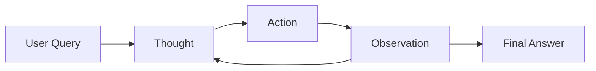

# Reasoning Strategies

The ReAct Agent Framework implements the **ReAct (Reasoning + Acting)** pattern, which combines reasoning and action in an iterative loop. This page explains how the pattern works and how to optimize agent reasoning.

## What is ReAct?

ReAct is an agent reasoning pattern that alternates between three phases:

1. **Thought (Reasoning)**: The agent thinks about what to do next
2. **Action (Acting)**: The agent executes a tool/action
3. **Observation**: The agent analyzes the result

This cycle continues until the agent has enough information to provide a final answer.



## How ReAct Works

### The ReAct Loop

```python
from react_agent_framework import ReactAgent

agent = ReactAgent(
    name="Research Assistant",
    provider="gpt-4o-mini",
    max_iterations=10  # Maximum reasoning cycles
)

@agent.tool()
def search(query: str) -> str:
    """Search the internet"""
    # Implementation
    return results

# The agent will follow this pattern:
answer = agent.run("What is the capital of France?", verbose=True)
```

**Output:**
```
Iteration 1:
Thought: I need to search for information about France's capital
Action: search
Action Input: capital of France
Observation: Paris is the capital and largest city of France...

Iteration 2:
Thought: I have the answer, Paris is the capital of France
Action: finish
Action Input: Paris is the capital of France
```

### Iteration Control

You can control how many reasoning cycles the agent performs:

```python
# Conservative agent (fewer iterations)
conservative_agent = ReactAgent(
    name="Quick Assistant",
    max_iterations=5  # Will stop after 5 cycles
)

# Thorough agent (more iterations)
thorough_agent = ReactAgent(
    name="Deep Researcher",
    max_iterations=20  # Can reason for up to 20 cycles
)

# Unlimited iterations (use with caution!)
unlimited_agent = ReactAgent(
    name="Persistent Agent",
    max_iterations=100
)
```

!!! warning "Iteration Limits"
    Setting `max_iterations` too high can lead to:

    - Higher API costs
    - Longer execution time
    - Potential infinite loops

    Start with 10 iterations and adjust based on your use case.

## Reasoning Optimization

### Custom Instructions

Guide agent reasoning with custom instructions:

```python
agent = ReactAgent(
    name="Data Analyst",
    provider="gpt-4o-mini",
    instructions="""You are a data analyst. Follow these guidelines:

    1. Always verify data before drawing conclusions
    2. Use calculations to support your analysis
    3. Provide specific numbers and percentages
    4. If data is missing, use search to find it
    5. Be concise but thorough in your answers
    """
)

@agent.tool()
def calculate(expression: str) -> str:
    """Perform calculations"""
    return str(eval(expression, {"__builtins__": {}}, {}))

@agent.tool()
def search(query: str) -> str:
    """Search for data"""
    # Implementation
    return results

# The agent will follow your guidelines
answer = agent.run(
    "What percentage of global GDP does the US represent?",
    verbose=True
)
```

### Temperature Control

Temperature affects reasoning creativity:

```python
# Deterministic reasoning (recommended for most cases)
deterministic_agent = ReactAgent(
    name="Precise Assistant",
    temperature=0  # Always picks most likely next token
)

# Balanced reasoning
balanced_agent = ReactAgent(
    name="Balanced Assistant",
    temperature=0.3  # Slight creativity
)

# Creative reasoning
creative_agent = ReactAgent(
    name="Creative Assistant",
    temperature=0.7  # More diverse responses
)
```

!!! tip "Temperature Guidelines"
    - **0.0**: Deterministic, same output every time (best for factual tasks)
    - **0.1-0.3**: Slightly varied, still consistent (good for most tasks)
    - **0.4-0.7**: Creative, diverse outputs (good for brainstorming)
    - **0.8-1.0**: Very creative, potentially inconsistent (use with caution)

## Advanced Patterns

### Multi-Step Reasoning

For complex tasks, the agent will chain multiple actions:

```python
from react_agent_framework import ReactAgent

agent = ReactAgent(
    name="Research Analyst",
    provider="gpt-4o-mini",
    max_iterations=15,  # Allow more steps
    instructions="""Break down complex questions into steps:
    1. Search for relevant information
    2. Verify facts with multiple sources
    3. Perform calculations if needed
    4. Synthesize final answer
    """
)

@agent.tool()
def search(query: str) -> str:
    """Search the internet"""
    from duckduckgo_search import DDGS
    with DDGS() as ddgs:
        results = list(ddgs.text(query, max_results=3))
    return "\n".join([f"{r['title']}: {r['body']}" for r in results])

@agent.tool()
def calculate(expression: str) -> str:
    """Perform calculations"""
    try:
        result = eval(expression, {"__builtins__": {}}, {})
        return f"Result: {result}"
    except Exception as e:
        return f"Error: {str(e)}"

# Complex multi-step query
answer = agent.run(
    "Compare the populations of Tokyo and New York City. "
    "Which is larger and by what percentage?",
    verbose=True
)
```

**Expected reasoning flow:**
```
Iteration 1:
Thought: I need to find Tokyo's population
Action: search
Action Input: Tokyo population 2024

Iteration 2:
Thought: Now I need New York City's population
Action: search
Action Input: New York City population 2024

Iteration 3:
Thought: I need to calculate the difference and percentage
Action: calculate
Action Input: ((37400000 - 8336000) / 8336000) * 100

Iteration 4:
Thought: I have all the information to answer
Action: finish
Action Input: Tokyo (37.4M) is larger than NYC (8.3M) by approximately 349%
```

### Objective-Driven Reasoning

Combine ReAct with objectives for goal-oriented behavior:

```python
from react_agent_framework import ReactAgent, Objective

# Define objectives
objectives = [
    Objective(
        goal="Research company revenue",
        priority="critical",
        success_criteria=["Find Q1 revenue", "Find Q2 revenue"]
    ),
    Objective(
        goal="Calculate growth rate",
        priority="high",
        success_criteria=["Calculate percentage growth"]
    ),
    Objective(
        goal="Provide investment recommendation",
        priority="medium",
        success_criteria=["Analyze data", "Make recommendation"]
    )
]

agent = ReactAgent(
    name="Financial Analyst",
    provider="gpt-4o-mini",
    objectives=objectives,  # Agent will work towards these goals
    max_iterations=20,
    instructions="Work through objectives systematically. Complete high-priority tasks first."
)

@agent.tool()
def search(query: str) -> str:
    """Search for financial data"""
    # Implementation
    return results

@agent.tool()
def calculate(expression: str) -> str:
    """Perform financial calculations"""
    return str(eval(expression, {"__builtins__": {}}, {}))

# Agent will reason towards completing objectives
answer = agent.run(
    "Analyze Apple's financial performance this year and provide investment recommendation",
    verbose=True
)

# Check objective completion
for obj in agent.objective_tracker.objectives:
    print(f"{obj.goal}: {obj.status}")
```

### Memory-Enhanced Reasoning

Use memory to maintain context across multiple queries:

```python
from react_agent_framework import ReactAgent
from react_agent_framework.core.memory import ChromaMemory

# Agent with persistent memory
agent = ReactAgent(
    name="Personal Assistant",
    provider="gpt-4o-mini",
    memory=ChromaMemory(
        collection_name="personal_assistant",
        persist_directory="./chroma_db"
    ),
    instructions="""Use conversation history to provide context-aware responses.
    Remember user preferences and previous interactions."""
)

@agent.tool()
def search(query: str) -> str:
    """Search the internet"""
    # Implementation
    return results

# First conversation
answer1 = agent.run("I'm planning a trip to Japan in cherry blossom season")
# Memory stores: user interested in Japan, cherry blossoms

# Later conversation (agent remembers context)
answer2 = agent.run("What's the weather like there in April?")
# Agent knows "there" = Japan, "April" = cherry blossom season

# Even later
answer3 = agent.run("Find me good hotels")
# Agent knows to search for hotels in Japan during April
```

## Debugging Reasoning

### Verbose Mode

Enable verbose mode to see agent's thought process:

```python
agent = ReactAgent(name="Debug Agent", provider="gpt-4o-mini")

# Run with verbose=True to see all reasoning steps
answer = agent.run(
    "What is 15% of 340?",
    verbose=True  # Shows Thought → Action → Observation
)
```

**Output:**
```
=== Iteration 1 ===
Thought: I need to calculate 15% of 340
Action: calculate
Action Input: 0.15 * 340
Observation: Result: 51.0

=== Iteration 2 ===
Thought: I have the answer
Action: finish
Action Input: 15% of 340 is 51

Final Answer: 15% of 340 is 51
```

### Analyzing Reasoning Quality

```python
from react_agent_framework import ReactAgent

agent = ReactAgent(
    name="Analyzer",
    provider="gpt-4o-mini",
    max_iterations=10
)

@agent.tool()
def search(query: str) -> str:
    """Search tool"""
    return f"Results for: {query}"

# Track iterations
class ReasoningTracker:
    def __init__(self):
        self.iterations = 0
        self.actions_taken = []

    def track(self, thought, action):
        self.iterations += 1
        self.actions_taken.append(action)

tracker = ReasoningTracker()

# Run agent
answer = agent.run("Find information about Python", verbose=True)

# Analyze
print(f"Total iterations: {tracker.iterations}")
print(f"Actions taken: {tracker.actions_taken}")
print(f"Efficiency: {'Good' if tracker.iterations < 5 else 'Needs optimization'}")
```

## Best Practices

### 1. Set Appropriate Iteration Limits

```python
# For simple queries
simple_agent = ReactAgent(max_iterations=5)

# For complex research
research_agent = ReactAgent(max_iterations=15)

# For multi-step tasks
complex_agent = ReactAgent(max_iterations=20)
```

### 2. Provide Clear Instructions

```python
# ❌ Bad: Vague instructions
agent = ReactAgent(
    instructions="Be helpful"
)

# ✅ Good: Specific guidelines
agent = ReactAgent(
    instructions="""Follow these steps:
    1. Break complex questions into sub-tasks
    2. Use search for factual information
    3. Use calculations for math
    4. Verify important facts with multiple sources
    5. Provide concise, accurate answers
    """
)
```

### 3. Use Temperature Wisely

```python
# ❌ Bad: High temperature for factual tasks
factual_agent = ReactAgent(temperature=0.9)  # Too creative

# ✅ Good: Low temperature for factual tasks
factual_agent = ReactAgent(temperature=0)  # Deterministic

# ✅ Good: Medium temperature for creative tasks
creative_agent = ReactAgent(temperature=0.5)
```

### 4. Monitor Iteration Count

```python
agent = ReactAgent(max_iterations=10)

answer = agent.run(query, verbose=True)

# If frequently hitting max_iterations, either:
# 1. Increase max_iterations
# 2. Improve instructions
# 3. Add more specific tools
# 4. Break task into smaller queries
```

## Comparison with Other Patterns

| Pattern | Reasoning | Actions | Memory | Best For |
|---------|-----------|---------|---------|----------|
| **ReAct** | ✅ Explicit | ✅ Tool-based | ✅ Optional | General-purpose tasks |
| **ReWOO** | ✅ Plan-first | ✅ Batched | ❌ No | Parallelizable tasks |
| **Reflection** | ✅ Self-critique | ✅ Iterative | ✅ Yes | Quality-critical tasks |
| **Plan-Execute** | ✅ Upfront planning | ✅ Sequential | ✅ Yes | Complex multi-step tasks |

!!! note "Framework Focus"
    This framework currently implements the **ReAct pattern**. Future versions may include additional patterns like ReWOO, Reflection, and Plan-Execute.

## Next Steps

- [Built-in Tools](built-in-tools.md) - Learn about available tools
- [Custom Tools](../guides/custom-tools.md) - Create your own tools
- [Memory Systems](memory-systems.md) - Add context and history
- [Objectives](objectives.md) - Goal-oriented agent behavior

## Further Reading

- [ReAct Paper](https://arxiv.org/abs/2210.03629) - Original research paper
- [LangChain ReAct](https://python.langchain.com/docs/modules/agents/agent_types/react) - Alternative implementation
- [Anthropic Agent Patterns](https://www.anthropic.com/research) - Research on agent reasoning
